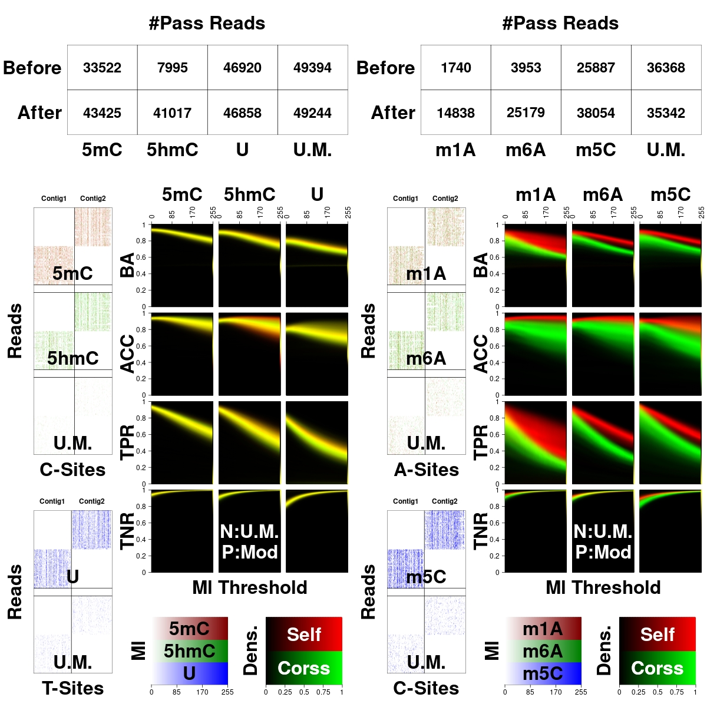
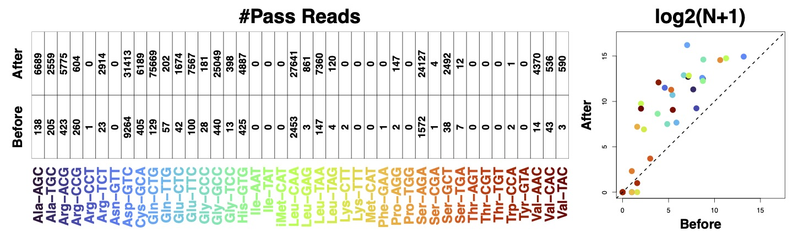

# IL-AD

We leverage machine learning approaches to adapt nanopore sequencing basecallers for nucleotide modification detection. We first apply the incremental learning technique to improve the basecalling of modification-rich sequences, which are usually of high biological interests. With sequence backbones resolved, we further run anomaly detection on individual nucleotides to determine their modification status. By this means, our pipeline promises the single-molecule, single-nucleotide and sequence context-free detection of modifications. 


<!--  <p align='center'></p> -->

## Dependencies

samtools: https://github.com/samtools/samtools

taiyaki: https://github.com/nanoporetech/taiyaki/tree/master/taiyaki

## Usage

### Incremental Learning

Training Process
```sh
python ./scripts/train.py model_template.py pretained_model.checkpoint input.hdf5 --device cuda:0 --outdir path/to/output \
--save_every epochs --niteration niterations --lr_max lr_max --lambda lambda --min_sub_batch_size batchsize
```

`model_template.py`: the model architecture, e.g. [taiyaki templates](https://github.com/nanoporetech/taiyaki/tree/master/models)

`pretained_model.checkpoint`: the model to be IL-ed, e.g. [taiyaki pretrained models](https://github.com/nanoporetech/taiyaki/tree/master/models)

`input.hdf5` : training dataset generated by [taiyki workflow](https://github.com/nanoporetech/taiyaki/tree/master?tab=readme-ov-file#steps-from-fast5-files-to-basecalling) 

`--device`: we suggested GPU for IL training

`--output`: the path of the output dictonary

`--save_every epochs`: Save the checkpoint every `epochs` iterations

`--niterations niterations`: the number of iterations in IL

`--lr_max lr_max`: the default learning rate in AdamW optimizer

`--lambda lambda`: we balanced $L_{CTC}$ and $L_{RBKD}$ using hyperparameter $\lambda$. $L_{CTC}$ speficies Connectionist Temporal Classification loss which calculates loss between the nanopore signal and target basecalled DNA/RNA sequence. $L_{RBKD}$ specified Response-Based Knowledge Distillation
(RBKD) which is the mechanisms to help prevent catastrophic forgetting.

`--min_sub_batch_size batchsize`: batchsize of the IL training

### Basecalling 

You should then be able to export your checkpoint to json (using `bin/dump_json.py` in [taiyaki](https://github.com/nanoporetech/taiyaki/tree/master)) that can be used to basecall with Guppy. The Guppy usage can be seen using `guppy_basecaller --help`.

Specifically, key options include selecting the Guppy config file to be appropriate for your application, and passing the complete path of your .json file.

For example:

```sh
guppy_basecaller --input_path /path/to/input_reads --save_path /path/to/save_dir --config path/to/config --model path/to/model --device cuda:0
```

### Anomaly Detection

```sh
python ./scripts/context_abnormal.py --device cuda:0 model_template.py initial_checkpoint.checkpoint \
input.hdf5 --outdir path/to/output --save_every save_every --niteration niteration  --sig_win_len n --min_sub_batch_size BATCHSIZE --right_len m --can BASE
```

`model_template.py`: the model architecture, e.g. [taiyaki templates](https://github.com/nanoporetech/taiyaki/tree/master/models)

`initial_checkpoint.checkpoint`: pretrained model used for AD initialization, e.g. [taiyaki pretrained models](https://github.com/nanoporetech/taiyaki/tree/master/models)

`input.hdf5` : training dataset generated by [taiyki workflow](https://github.com/nanoporetech/taiyaki/tree/master?tab=readme-ov-file#steps-from-fast5-files-to-basecalling) 

`--sig_win_len n --right_len m`: the length of signal the AD model extracts **left n plus right n+m points** from the starting point of the candidate base.

### Modification Inference

```sh
python ./scripts/modification_inference.py input.hdf5 can.checkpoint mod.checkpoint CANBASE MODBASE path/to/output/fasta --can_base_idx can_base_idx --type rna/dna --length n --right_len m
```

`input.hdf5`: reads to be analyzed stored in hdf5 format, following [taiyki workflow](https://github.com/nanoporetech/taiyaki/tree/master?tab=readme-ov-file#steps-from-fast5-files-to-basecalling).

`can.checkpoint`: the AD-trained model using canonical training dataset.

`mod.checkpoint`: the AD-trained model using modfication training dataset.

`CANBASE`: the canonical label of the candidate base

`MODBASE`: the modification label of the candidate base

`--can_base_idx can_base_idx`: means the mapping from alphabet labels in the hdf5 files to canonical labels(**default** 0123 ATGC). For example, for a hdf5 whose labels are ACm(5mC)h(5hmC)GT, the can_base_idx should be 01123.

`--type rna/dna`: the type of the nanopore sequencing. If rna, the output fasta will reverse the sequence.

`--length n --right_len m`: the length of signal the AD model extracts **left n plus right n+m points** from the starting point of the candidate base.


After generating fasta file containing mod base we can use `./scripts/modbase_tag.py` to write ML/MM tag into the bam file. We can merge ML/MM tags from different bams containing different kinds of modifications using `./scripts/merge_bam.py`.

## Miscellanies

### RNA Splicing

If you are dealing with mRNA data and your reference is the genome reference fasta file, you need to pay more attention on RNA splicing.

If you want to create training hdf5 files or mapped reads for modification inference according to https://github.com/nanoporetech/taiyaki/tree/master#steps-from-fast5-files-to-basecalling, you should replace the `bin/get_ref_from_sam.py` in taiyaki with `./scripts/rna_process/get_ref_from_sam_rna.py` in our project.

### tRNA Specific Processing

If you want to implement iterative labeling, you need to train model with `bin/train_flip_flop.py` in taiyaki. However, if you need to handle with tRNA data, please replace it with `./scripts/trna/train_flip_flop.py` in our project.


## Example

Example for the DNA modification detection using IL-AD for the figure below.

**IL-STEP**:

```sh
#### Incremental learning
python ./scripts/train.py --device cuda:0 taiyaki/models/mLstm_cat_mod_flipflop.py taiyaki/models/mLstm_flipflop_model_r941_DNA.checkpoint train.hdf5 --outdir path/to/output --save_every 100 --niteration 500 --warmup_batches 5 --lr_max 5.0e-5
python taiyaki/bin/dump_json path/to/output/model_final.checkpoint -output path/to/output/model_final.json

#### Basecalling
guppy_basecaller --input_path raw/fast5/canonical --save_path path/to/output/canonical --align_ref path/to/refrence/genome --align_type auto --bam_out --model_file path/to/output/model_final.json --chunk_size 60 --device cuda:0 --disable_qscore_filtering
guppy_basecaller --input_path raw/fast5/5mc --save_path path/to/output/5mc --align_ref path/to/refrence/genome --align_type auto --bam_out --model_file path/to/output/model_final.json --chunk_size 60 --device cuda:0 --disable_qscore_filtering
guppy_basecaller --input_path raw/fast5/5hmc --save_path path/to/output/5hmc --align_ref path/to/refrence/genome --align_type auto --bam_out --model_file path/to/output/model_final.json --chunk_size 60 --device cuda:0 --disable_qscore_filtering
guppy_basecaller --input_path raw/fast5/u --save_path path/to/output/u --align_ref path/to/refrence/genome --align_type auto --bam_out --model_file path/to/output/model_final.json --chunk_size 60 --device cuda:0 --disable_qscore_filtering

```

Prepare hdf5 using steps at taiyaki

```sh
bin/generate_per_read_params.py <directory containing fast5 files> --output <name of output per_read_tsv file>

bin/get_refs_from_sam.py <genomic references fasta> <one or more SAM/BAM files> --output <name of output reference_fasta>

bin/prepare_mapped_reads.py <directory containing fast5 files> <per_read_tsv> <output mapped_signal_file>  <file containing model for remapping>  <reference_fasta>

bin/train_flipflop.py --device <digit specifying GPU> <pytorch model definition> <mapped-signal files to train with>
```

After we generate the `test.hdf5`, we implement modification inference. **AD-STEP**

```sh
#### Anomaly Detection Training
python ./scripts/context_abnormal.py --device cuda:0 taiyaki/models/mLstm_cat_mod_flipflop.py taiyaki/models/mLstm_flipflop_model_r941_DNA.checkpoint \
$path/datasets/canonical/train.hdf5 --outdir path/to/output/c --save_every 200 --niteration 2000 --warmup_batches 50 --sig_win_len 20 --can C --min_sub_batch_size 1024 --right_len 10

python ./scripts/context_abnormal.py --device cuda:0 taiyaki/models/mLstm_cat_mod_flipflop.py taiyaki/models/mLstm_flipflop_model_r941_DNA.checkpoint \
$path/datasets/canonical/train.hdf5 --outdir path/to/output/c --save_every 200 --niteration 2000 --warmup_batches 50 --sig_win_len 20 --can T --min_sub_batch_size 1024 --right_len 10

python ./scripts/context_abnormal.py --device cuda:0 taiyaki/models/mLstm_cat_mod_flipflop.py taiyaki/models/mLstm_flipflop_model_r941_DNA.checkpoint \
path/to/5mC/train.hdf5 --outdir path/to/output/5mc --save_every 200 --niteration 2000 --warmup_batches 50 --sig_win_len 20 --can m --min_sub_batch_size 1024 --right_len 10

python ./scripts/context_abnormal.py --device cuda:0 taiyaki/models/mLstm_cat_mod_flipflop.py taiyaki/models/mLstm_flipflop_model_r941_DNA.checkpoint \
path/to/5hmC/train.hdf5 --outdir path/to/output/5hmc --save_every 200 --niteration 2000 --warmup_batches 50 --sig_win_len 20 --can h --min_sub_batch_size 1024 --right_len 10

python ./scripts/context_abnormal.py --device cuda:0 taiyaki/models/mLstm_cat_mod_flipflop.py taiyaki/models/mLstm_flipflop_model_r941_DNA.checkpoint \
path/to/u/train.hdf5 --outdir path/to/output/u --save_every 200 --niteration 2000 --warmup_batches 50 --sig_win_len 20 --can u --min_sub_batch_size 1024 --right_len 10

#### Modification Inference

# c 5mc 5hmc

python ./scripts/modification_inference.py test.hdf5 path/to/output/c/model_final.checkpoint path/to/output/5mc/model_final.checkpoint C m path/to/output/fasta/m.fasta --can_base_idx 0123 --length 20 --right_len 10
python ./scripts/modification_inference.py test.hdf5 path/to/output/c/model_final.checkpoint path/to/output/5hmc/model_final.checkpoint C h path/to/output/fasta/h.fasta --can_base_idx 0123 --length 20 --right_len 10
python ./scripts/modbase_tag.py path/to/output/merge.sorted.bam(IL)  path/to/output/fasta/m.fasta  path/to/output/fasta/m.ml path/to/output/bam/m.bam --can C --mod m 
python ./scripts/modbase_tag.py path/to/output/merge.sorted.bam(IL)  path/to/output/fasta/h.fasta  path/to/output/fasta/h.ml path/to/output/bam/h.bam --can C --mod h

# T u
python ./scripts/modification_inference.py test.hdf5 path/to/output/t/model_final.checkpoint path/to/output/u/model_final.checkpoint T u path/to/output/fasta/u.fasta --can_base_idx 0123 --length 20 --right_len 10
python ./scripts/modbase_tag.py path/to/output/merge.sorted.bam(IL)  path/to/output/fasta/u.fasta  path/to/output/fasta/u.ml path/to/output/bam/u.bam --can C --mod h
```

If we have more than one kind of modification for one base, please first use `samtools` to sort and index all the output bam files, and then:

```sh
python ./scripts/merge_bam.py path/to/output/bam/merge.bam path/to/output/bam/m.sorted.bam path/to/output/bam/h.sorted.bam 
```



<p align='center'><b>Accuracy on DNA(canonical, fully modified 5mC, 5hmC, Pseudouridine)/RNA(canonical, fully modified 5mC, 6mA, 1mA) synthesized oligo</b></p>

<!--

<p align='center'><b>Incremental learning benefit the reads mappability of tRNA</b></p>-->

## Pretrained model

For DNA/RNA curlcake, the model after incremental learning and the model for modification inference are available at models.

## Citation & Contact

Ziyuan Wang PhD student in University of Arizona, R. Ken Coit College of Pharmcay, email:princezwang@arizona.edu
